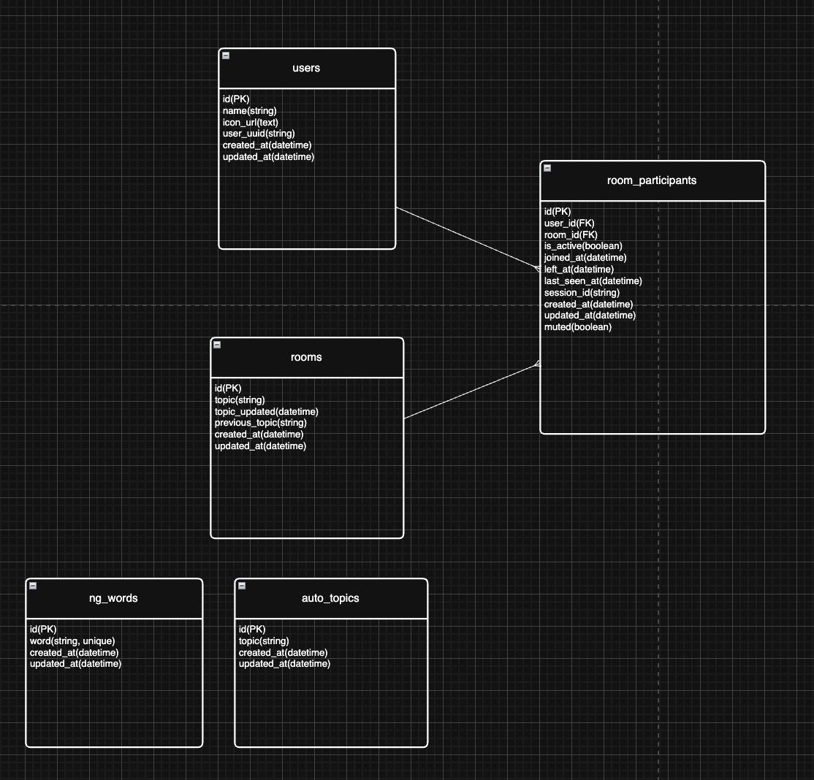

# プロジェクト名：『声友』

# 目次

- [プロジェクト名：『声友』](#プロジェクト名声友)
- [目次](#目次)
- [サービス概要](#サービス概要)
- [サービスURL](#サービスurl)
    - [https://app.rails-kt.com](#httpsapprails-ktcom)
- [サービス開発の背景](#サービス開発の背景)
- [機能紹介](#機能紹介)
- [技術構成について](#技術構成について)
  - [使用技術](#使用技術)
  - [ER図](#er図)
  - [画面遷移図](#画面遷移図)

# サービス概要

〜 匿名ですぐにつながれる、シニア世代向け無料グループ通話アプリ 〜

『声友』は、身体的・経済的な理由から外出や交流の機会が限られやすい方でも、気軽に会話へ参加できる場を目指したコミュニティアプリです。
ユーザーは個人情報の登録なしで利用を始められ、部屋ごとに表示される話題を見ながら、そのまま音声通話に参加できます。

PWA に対応しているため、スマートフォンではホーム画面への追加もしやすく、アプリのインストールに不慣れな方でも導入しやすい設計にしています。
今後は、会話中は個人情報に関する注意喚起や NG ワード検知を通じて、安心して利用しやすい環境づくりに貢献できるように機能を実装する予定です。

# サービスURL

### [https://app.rails-kt.com](https://app.rails-kt.com)

# サービス開発の背景

近所に住む高齢の方が、以前は元気に散歩や庭の手入れをされていた一方で、最近では歩行が難しくなり介護サービスを利用されるようになった姿を見て、
身体機能の低下によって人との交流機会が急に減ってしまう現実を身近に感じました。

会話そのものは十分にできるのに、外出や移動が難しいために「誰かと話したい」という気持ちを満たしにくい方は少なくないと考えています。
そこで、複雑な登録や操作をできるだけ省き、誰でもすぐに会話へ入れる音声コミュニティとして『声友』を開発しました。

本サービスでは、次のような課題を少しでも和らげることを目指しています。

- 外出機会の減少により、人と話すきっかけが作りづらい点
- スマートフォン操作に不慣れで、新しいアプリの導入や会員登録が負担になりやすい点
- 個人情報や詐欺被害への不安から、オンライン上の交流に抵抗が生まれやすい点

# 機能紹介

利用開始

トップページからそのまま利用を始められます。
ログイン情報の入力を前提とせず、初回導線を短くすることで、操作に不慣れな方でも使い始めやすくしています。

ニックネーム・アイコン設定

匿名性を保ちながら参加できるよう、ユーザー情報はニックネームとアイコンを中心に構成しています。
個人情報を細かく入力しなくても、他の参加者と区別できる設計です。

通話部屋一覧 / トピック表示

部屋一覧画面では、各ルームのトピックと参加人数を確認できます。
どの部屋で何人入室してどのような会話をしているかをリアルタイムで反映しており、これらを入室前に把握することで参加のハードルを下げることを目的としております。

リアルタイム音声通話

各部屋では WebRTC を用いたグループ通話が行えます。
Action Cable をシグナリングに利用し、参加中メンバーの表示、発話状況の可視化、ミュート中のユーザーをリアルタイムで反映させUXの向上に意識しています。

トピック編集・自動反映

部屋の話題は更新でき、変更内容は Turbo Stream を通じて画面へ即時反映されます。
会話のきっかけを作りやすくし、参加者同士が話し始めやすい状態を保てるようにしています。

友達紹介

QRコードやメールを経由して、友達へアプリの紹介をできるようにしています。

PWA / ホーム画面追加

Android ではインストールプロンプトを利用でき、iPhone ではホーム画面追加手順を画面内で案内します。
アプリストアを介さず導入できるため、利用開始までの負担を抑えています。

NG ワード検知・注意喚起

会話中は Web Speech API を使った音声のテキスト化と NG ワード判定を組み合わせ、
不適切な表現や個人情報に関わる会話への注意喚起を表示できるようにしています。
安心して参加しやすい通話空間づくりを支える機能です。

# 技術構成について

## 使用技術

| カテゴリ | 技術内容 |
| --- | --- |
| サーバーサイド | Ruby 3.3.10 / Ruby on Rails 7.2.2 |
| フロントエンド | HTML / CSS / JavaScript / Hotwire |
| CSS | Tailwind CSS 4 |
| リアルタイム通信 | Action Cable |
| 音声通話 | WebRTC |
| STUN サーバー | Google STUN Server / `stun.turn-kt.com:3478` |
| 音声認識 | Web Speech API |
| QR コード | rqrcode |
| データベース | PostgreSQL |
| インフラ | Docker / AWS EC2 / Nginx / Neon |
| その他 | PWA / esbuild |

## ER図

## 画面遷移図

[https://github.com/taka-thor/myapp/blob/master/docs/screen_transition.md](https://github.com/taka-thor/myapp/blob/master/docs/screen_transition.md)

