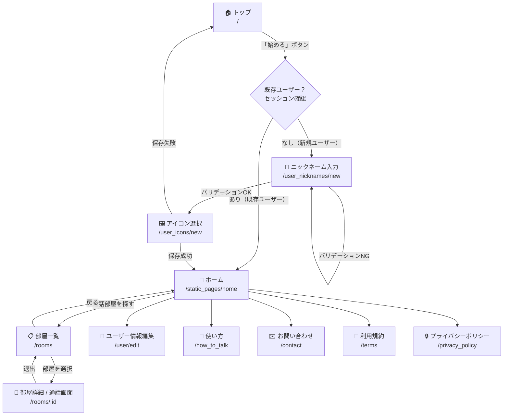

# 声友 画面遷移図

```mermaid
flowchart TD
    TOP["🏠 トップ\n/"]
    SESSION{"既存ユーザー？\nセッション確認"}
    NICKNAME["📝 ニックネーム入力\n/user_nicknames/new"]
    ICON["🖼️ アイコン選択\n/user_icons/new"]
    HOME["🏡 ホーム\n/static_pages/home"]
    ROOMS["📋 部屋一覧\n/rooms"]
    ROOM_SHOW["🚪 部屋詳細 / 通話画面\n/rooms/:id"]
    USER_EDIT["👤 ユーザー情報編集\n/user/edit"]
    HOW_TO["📖 使い方\n/how_to_talk"]
    CONTACT["✉️ お問い合わせ\n/contact"]
    TERMS["📄 利用規約\n/terms"]
    PRIVACY["🔒 プライバシーポリシー\n/privacy_policy"]

    TOP -->|"「始める」ボタン"| SESSION
    SESSION -->|"あり（既存ユーザー）"| HOME
    SESSION -->|"なし（新規ユーザー）"| NICKNAME
    NICKNAME -->|"バリデーションOK"| ICON
    NICKNAME -->|"バリデーションNG"| NICKNAME
    ICON -->|"保存成功"| HOME
    ICON -->|"保存失敗"| TOP

    HOME -->|"通話部屋を探す"| ROOMS
    HOME --> USER_EDIT
    HOME --> HOW_TO
    HOME --> CONTACT
    HOME --> TERMS
    HOME --> PRIVACY

    ROOMS -->|"部屋を選択"| ROOM_SHOW
    ROOM_SHOW -->|"退出"| ROOMS
    ROOMS -->|"戻る"| HOME

    click TOP "https://github.com/taka-thor/myapp/blob/master/docs/images/top.png" _blank
    click HOME "https://github.com/taka-thor/myapp/blob/master/docs/images/home.png" _blank
    click NICKNAME "https://github.com/taka-thor/myapp/blob/master/docs/images/nickname.png" _blank
    click ICON "https://github.com/taka-thor/myapp/blob/master/docs/images/icon.png" _blank
    click ROOMS "https://github.com/taka-thor/myapp/blob/master/docs/images/rooms.png" _blank
    click ROOM_SHOW "https://github.com/taka-thor/myapp/blob/master/docs/images/room_show.png" _blank
    click USER_EDIT "https://github.com/taka-thor/myapp/blob/master/docs/images/user_edit.png" _blank
    click HOW_TO "https://github.com/taka-thor/myapp/blob/master/docs/images/how_to_talk.png" _blank
    click CONTACT "https://github.com/taka-thor/myapp/blob/master/docs/images/contact.png" _blank
    click TERMS "https://github.com/taka-thor/myapp/blob/master/docs/images/terms.png" _blank
    click PRIVACY "https://github.com/taka-thor/myapp/blob/master/docs/images/privacy.png" _blank
```
